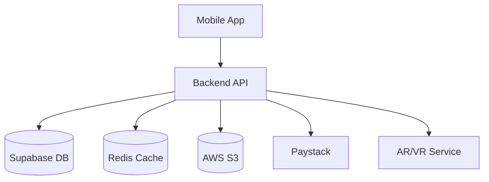

# Fashionista System Patterns

## System Architecture

### High-Level Architecture


### Component Relationships

#### Frontend (Mobile App)
1. React Native (Expo) Architecture
   - Component-based structure
   - Redux for state management
   - React Navigation for routing
   - Styled Components for styling

2. Key Modules
   - Authentication
   - Store Management
   - Product Catalog
   - AR/VR Integration
   - Payment Processing
   - User Profile

#### Backend (Node.js/Express)
1. API Layer
   - RESTful endpoints
   - WebSocket server
   - Authentication middleware
   - Rate limiting
   - Request validation

2. Service Layer
   - User service
   - Store service
   - Product service
   - Payment service
   - AR/VR service
   - Analytics service

3. Data Layer
   - Supabase for primary storage
   - Redis for caching
   - AWS S3 for media storage

## Design Patterns

### Frontend Patterns
1. Component Patterns
   - Atomic Design
   - Container/Presenter
   - Higher-Order Components
   - Custom Hooks

2. State Management
   - Redux for global state
   - Context API for theme/auth
   - Local state for UI
   - Async state handling

3. Navigation
   - Stack navigation
   - Tab navigation
   - Deep linking
   - Authentication flow

### Backend Patterns
1. API Design
   - RESTful principles
   - Resource-based routing
   - Versioning strategy
   - Error handling

2. Service Layer
   - Repository pattern
   - Factory pattern
   - Strategy pattern
   - Observer pattern

3. Security Patterns
   - JWT authentication
   - Role-based access
   - Input validation
   - Rate limiting
   - CORS policies

## Technical Decisions

### Database
1. Supabase
   - PostgreSQL-based
   - Real-time capabilities
   - Row-level security
   - Built-in authentication

2. Redis
   - Session management
   - Cache layer
   - Rate limiting
   - Real-time features

### Storage
1. AWS S3
   - Media storage
   - CDN integration
   - Backup storage
   - Static assets

### Security
1. Authentication
   - JWT-based auth
   - OAuth integration
   - Session management
   - 2FA support

2. Data Protection
   - End-to-end encryption
   - Data encryption at rest
   - Secure communication
   - Regular audits

### Performance
1. Optimization Strategies
   - Caching layers
   - Lazy loading
   - Image optimization
   - Code splitting

2. Monitoring
   - Error tracking
   - Performance metrics
   - User analytics
   - System health

## Development Workflow

### Code Organization
1. Frontend
   ```
   mobile/
   ├── src/
   │   ├── components/
   │   ├── screens/
   │   ├── navigation/
   │   ├── services/
   │   ├── store/
   │   └── utils/
   ```

2. Backend
   ```
   backend/
   ├── src/
   │   ├── controllers/
   │   ├── services/
   │   ├── models/
   │   ├── middleware/
   │   ├── utils/
   │   └── config/
   ```

### Testing Strategy
1. Unit Testing
   - Jest for frontend
   - Mocha for backend
   - Component testing
   - Service testing

2. Integration Testing
   - API testing
   - End-to-end testing
   - Performance testing
   - Security testing

### Deployment
1. CI/CD Pipeline
   - Automated testing
   - Code quality checks
   - Security scanning
   - Deployment automation

2. Environment Strategy
   - Development
   - Staging
   - Production
   - Feature branches 